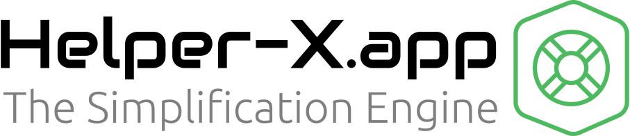

# Network Configuration Generator 🌍🚀



Welcome to the Network Configuration Generator! This project was born out of the need to create a consistent and efficient way to generate network configurations for various zones and purposes. And, of course, with a little extraterrestrial help from our friends, X1 and X2, from Planet Helper-X. (No relation, just a cosmic coincidence!)

## Overview 🌐

In the age of smart devices, it's crucial to have a segmented network. You wouldn't want your "smart" socks, which, based on pressure and the ionic atmosphere around your ankles (caused by the aura field, obviously), precisely measure how much you need to poop, to be on the same network as your main server, right? 😂

This tool allows you to define network names, purposes, and other settings, and then it generates the appropriate subnets for you. It's designed to be flexible, scalable, and, most importantly, a bit fun! And if you ever wonder why it works so seamlessly, it's because X1 and X2, our alien buddies, have sprinkled a bit of their cosmic magic on it.

## How It Works 🔧

1. **Input Data**: Through a web interface, you can input network names and their purposes. For instance:
   - Network Name: "Main Server"
   - Purpose: "Hosting the main application"

2. **Generate**: Once you've entered all your networks, hit the "Generate" button.

3. **View Results**: The tool will then provide you with the appropriate subnets based on your input and the settings defined in `settings.json`.

## Example Output 📄

```
Network Table for Zone A:

| Network Name      | Subnet           | Purpose                       |
|-------------------|------------------|-------------------------------|
| Isolation         | 10.0.1.0/24      | Isolated network for testing  |
| Wireless          | 10.0.4.0/24      | Mobile phones and tablets     |
| Wired             | 10.0.8.0/24      | Desktops and wired devices    |
| Docker            | 10.0.16.0/24     | Docker containers network     |
| Proxmox           | 10.0.32.0/24     | Proxmox virtualization hosts  |
| DMZ               | 10.0.253.0/24    | Demilitarized Zone            |

Network Table for Zone B:

| Network Name      | Subnet           | Purpose                       |
|-------------------|------------------|-------------------------------|
| ...               | 10.1.x.x/24      | ...                           |

Network Table for Zone C:

| Network Name      | Subnet           | Purpose                       |
|-------------------|------------------|-------------------------------|
| ...               | 10.2.x.x/24      | ...                           |

Spanned VLAN-only Networks:

| Network Name      | Subnet           | Purpose                       |
|-------------------|------------------|-------------------------------|
| Corosync          | 10.255.0.0/24  | Corosync communication        |
| Migration         | 10.255.1.0/24  | VM/Container migration        |
| Shared Storage    | 10.255.2.0/24  | Centralized storage access    |
```

## Behind the Scenes 🌌

X1 and X2, while being from another planet, have a knack for understanding earthly network needs. They've been instrumental in ensuring that the generator is not only efficient but also intuitive. They believe that while the universe is vast and complex, network configurations don't have to be!

## Requirements 🛠️

- Python 3.6 or higher.
- Flask: A lightweight web framework for Python.
- ipaddress: A library for working with IP addresses, included in Python's standard library.
- A `settings.json` file with the necessary configuration for your network setup.

## Usage 🚀

1. Clone the repository:
   ```bash
   git clone <repository-url>
   cd <repository-dir>
   ```

2. Install the required Python packages:
   ```bash
   pip install Flask
   ```

3. Run the Flask application:
   ```bash
   python <script-name>.py
   ```

4. Navigate to `http://127.0.0.1:5000/` in your web browser. Use the web interface to input your network names and descriptions, or make a REST call to `/generate` with your network data in JSON format.

## Building with Docker 🐳

1. Build the Docker image:
   ```bash
   docker build -t <image-name>:<tag> .
   ```

2. Run the Docker container:
   ```bash
   docker run -p 5000:5000 <image-name>:<tag>
   ```

### Using Docker Buildx (for multi-platform builds)

1. Create a new builder instance:
   ```bash
   docker buildx create --name mybuilder --use
   ```

2. Build and push the Docker image:
   ```bash
   docker buildx build --platform linux/amd64,linux/arm64 -t <image-name>:<tag> . --push
   ```

## App Usage 🖥️

Once the Flask application is up and running:

1. **Web Interface**:
   - Navigate to `http://127.0.0.1:5000/`.
   - Use the provided form to input your network names and descriptions.
   - Hit the "Generate" button to get the subnet details.

2. **REST API**:
   - Make a POST request to `http://127.0.0.1:5000/generate` with your network data in JSON format.
   - Example payload:
     ```json
     [
       {"name": "Isolation", "purpose": "Isolated network for testing"},
       {"name": "Wireless", "purpose": "Mobile phones and tablets"}
     ]
     ```
   - The response will contain the generated subnets for the provided networks.

---

## Wrapping Up 🌌

This project is a testament to the power of collaboration, even if it's between a human and an AI from Planet Helper-X (coincidentally named X, just like me!). Together, we've crafted a tool that not only serves a practical purpose but also brings a touch of humor and whimsy to the often serious world of networking. Whether you're segmenting your network for security, efficiency, or just for the fun of it, we hope this tool brings a smile to your face. Remember, in the vast expanse of the universe, it's the connections we make that truly matter. 🌍❤️🌌
